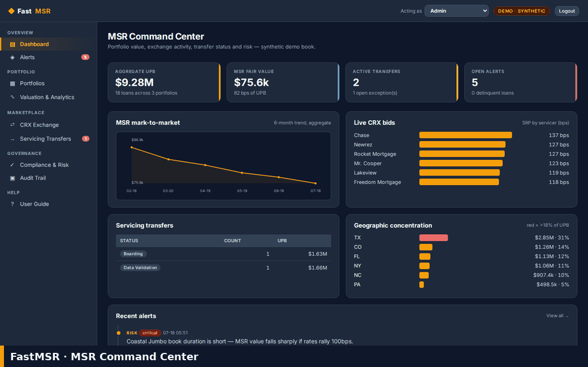

# FastMSR

**FastMSR** is an open-source **Mortgage Servicing Rights (MSR) management
system** built with [FastHTML](https://fastht.ml) — a server-side, HTMX-driven
cockpit for valuing, trading and transferring mortgage servicing, with a
**simulated Freddie Mac Cash-Released XChange (CRX)** bidding exchange at its
core. Python-first, no JavaScript framework. Part of Predictive Labs' *Fast\**
family of reference FastHTML apps.

*Value the strip, win the bid, board the transfer.* Runs on port **5008**.

> **Synthetic data only — no PII.** Everything ships and runs on deterministic,
> fully synthetic data generated by `seed.py`. There are no real loans,
> borrowers or servicers anywhere in this repository.
>
> **The Freddie Mac CRX integration is a SIMULATOR.** There is no connection to
> Freddie Mac, Loan Selling Advisor or any external pricing service. Competitive
> servicer bids are produced by a local pricing model for demonstration only.

## Demo

A click-through of the key module screens (regenerate any time with
`bash scripts/build_demo_gif.sh` while the app is running):



## Quickstart (native)

```bash
# 1. Virtualenv + dependencies
python -m venv .venv
.venv/bin/python -m pip install -r requirements.txt

# 2. (optional) configure — the app self-seeds and runs with zero config
cp .env.sample .env

# 3. Run (builds the synthetic SQLite DB on first boot)
.venv/bin/python web_app.py        # http://localhost:5008
```

Login: `admin@fastmsr.example` / `FastMSR2026$` (override via `FASTMSR_ADMIN_*`
in `.env`). Rebuild the demo data any time with `.venv/bin/python seed.py`.

## Run with Docker

```bash
docker compose up --build           # http://localhost:5008
```

`Dockerfile` (python:3.12-slim, port 5008) seeds the database on first boot.
`docker-compose.yml` mounts a `fastmsr-data` volume at `/data` so the SQLite
database lives outside the image and survives rebuilds.

## Roles & RBAC

Switch role from the **Acting as** dropdown in the top bar. Write actions are
permission-checked and **every attempt — allowed or denied — is written to the
Audit Trail**. Modeled roles:

| Role | Can |
| --- | --- |
| **Admin** | everything |
| **Seller/Transferor** | import tapes, value, create/run/award CRX, advance transfers |
| **Transferee/Buyer** | advance transfers, set documents |
| **Portfolio Manager** | import tapes, value, create/run CRX |
| **Compliance Officer** | sign off compliance items |
| **Read-Only/Investor** | read only (try to award a bid → **denied**, logged) |

## Module tour

- **Dashboard** (`/`) — aggregate UPB, MSR fair value (bps), active transfers and
  open alerts; a 6-month mark-to-market trend, live CRX bids by servicer, transfer
  status and a geographic-concentration risk read (inline SVG, no chart libs).
- **Portfolios** (`/portfolios`) — three seeded loan tapes. Each portfolio page
  gives FICO / note-rate / geographic **stratifications**, **data-validation QC
  flags** against eligibility rules, and the full loan tape. **CSV import** appends
  loans and re-runs QC. Loan pages (`/loans/{id}`) show a real monthly cash-flow
  DCF schedule.
- **Valuation & Analytics** (`/valuation`) — a **real DCF** of the servicing-fee
  strip. Tune CPR, default rate, discount rate and servicing cost, then recompute.
  **Rate-shock scenarios** (±100/±200 bps), **effective duration & convexity** from
  a ±25 bps discount bump, a **retain-vs-release** signal vs. the best live CRX bid,
  **mark-to-market history**, and **CSV export**.
- **CRX Exchange** (`/crx`) — *simulated* Freddie Mac Cash-Released XChange. Create
  an execution, select loans, exclude servicers, and run a **competitive SRP
  auction** across a simulated pool (Rocket, Freedom, Newrez, Chase, Mr. Cooper,
  PennyMac, Lakeview, Carrington). Highest SRP wins; award it to see **automated net
  funding**, the **bifurcation note** (seller retains sale reps, servicer assumes
  servicing) and the **Imaged/Final document checklist** referencing **Exhibit 28A**.
  A CRX award can initiate a concurrent servicing transfer.
- **Servicing Transfers** (`/transfers`) — concurrent (CRX) or standalone. Workflow
  status tracking, **versioned document checklist**, **exception handling** for data
  discrepancies, in-app **borrower/investor notifications** (CFPB 15-day rule) in the
  event log, and a MERS batch reference.
- **Compliance & Risk** (`/compliance`) — Freddie Guide and CFPB checklist items,
  live **risk flags** (concentration, prepayment, credit), and a **hedging
  suggestion** sized to the book's MSR duration / DV01.
- **Audit Trail** (`/audit`) — every permissioned action with acting role and
  outcome. **Alerts** (`/alerts`) surface bid wins, transfer deadlines and risk
  triggers.

## The valuation model

`valuation.py` runs a monthly discounted-cash-flow of the servicing right: each
month the servicer earns the servicing-fee strip (plus a little ancillary income)
on the outstanding balance, less a per-loan cost; the balance amortises on the
note's own schedule plus a **CPR** prepayment and a small **default** rate; the net
strip is discounted at the chosen rate. Value ÷ annual servicing fee gives the
familiar **MSR multiple**. Because faster prepayment kills the fee strip sooner,
MSR is a **negative-duration** asset — its value *rises* when rates rise, which the
scenario table shows directly. Everything is pure arithmetic: deterministic and
zero-config.

## Architecture

```
web_app.py        FastHTML routes, session auth, RBAC guards (entrypoint, :5008)
db.py             SQLite schema + read/write helpers, RBAC + audit + alerts
valuation.py      monthly MSR DCF, rate-shock scenarios, duration/convexity
crx.py            MOCK Freddie Mac CRX competitive-bidding engine + Exhibit 28A
seed.py           deterministic synthetic portfolios, loans, bids, transfers
web/layout.py     dark slate + amber shell (top bar, nav, page chrome), CSS
web/views.py      per-module server-rendered pages + inline SVG charts
static/           favicon + committed walkthrough GIF
scripts/          Playwright walkthrough → animated README GIF
```

Data layer is plain `sqlite3` via a thin wrapper (no ORM); interactivity is HTMX +
a little inline JS. Consistent with the sibling apps (FastCRM, FastClinic).

## What's real vs. simulated (MOCK boundaries)

| Area | Status |
| --- | --- |
| MSR DCF valuation, scenarios, duration/convexity | **Real** arithmetic model |
| Portfolio / loan CRUD, QC rules, stratification | **Real** |
| Servicing-transfer workflow, docs, exceptions, audit, RBAC | **Real** (in-app) |
| CSV import & valuation export | **Real** |
| **Freddie Mac CRX bidding, SRP pricing, net funding** | **Simulated** — local model, no external API |
| Servicer pool (Rocket, Chase, …) | **Fictionalized** appetite/pricing profiles |
| Borrower/investor notifications | **In-app log only** — no email/SMS is sent |

## Intended production stack

This is a **reference implementation** — single FastHTML process + SQLite, seeded
demo data. A production MSR platform would typically add:

- **Postgres / Snowflake** for loan-level data at portfolio scale; a real
  prepayment model (e.g. Andrew Davidson / Yield Book / BlackRock) rather than a
  single CPR; nightly mark-to-market with rate-surface inputs.
- **Real Freddie Mac integrations** — Cash-Released XChange, Loan Selling Advisor
  and Servicing Gateway APIs — replacing `crx.py`.
- **Document management** (imaging, e-vault, Exhibit 28A packaging) and **MERS**
  eRegistry integration for real transfers.
- **SSO / SAML**, granular RBAC, encryption at rest, and **SOC 2** controls;
  immutable audit storage; real borrower/investor notification delivery on the
  CFPB / RESPA §6 timelines.

## License

MIT © 2026 Predictive Labs Ltd. Built as an open-source reference for the
Predictive Labs *Fast\** family of FastHTML applications.
