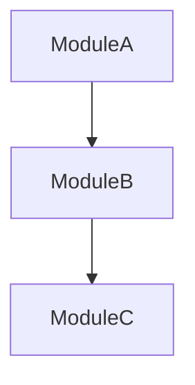

# 功能模块设计

> 在架构设计之后、界面设计之前使用。
> 将需求分解为功能模块，定义模块职责、接口和协作关系。

---

## 一、功能-模块分配矩阵

将需求优先级表中的每项功能分配到对应的模块：

| 功能 | 优先级 | 所属模块 | 依赖模块 | 实现复杂度 |
|------|--------|---------|---------|-----------|
| 示例：按条件搜索 | Must | SearchModule | ApiClient | 低 |
| 示例：批量下载 | Must | DownloadModule | SearchModule, FileModule | 中 |
| 示例：定时任务 | Should | SchedulerModule | SearchModule, DownloadModule | 高 |

**分配原则**：
- 每个功能有且仅有一个"所属模块"
- 模块间依赖尽量单向，避免循环依赖
- Must 功能优先分配到核心模块

---

## 二、模块接口契约

每个模块定义明确的输入/输出/异常：

### 模块名称：________________

| 维度 | 定义 |
|------|------|
| **职责** | |
| **不负责** | |
| **依赖模块** | |
| **对外接口** | |

#### 接口 1：________________

| 属性 | 说明 |
|------|------|
| 方法签名 | `def method_name(param: type) -> ReturnType` |
| 输入说明 | |
| 输出说明 | |
| 异常情况 | |
| 调用示例 | |

---

## 三、模块依赖图（Mermaid）



**规则**：
- 箭头方向：依赖方 → 被依赖方
- 禁止循环依赖
- 每层之间通过接口通信，不直接访问内部数据

---

## 四、数据流图

```
用户输入 → [模块A 校验] → [模块B 处理] → [模块C 存储] → 展示
                                          ↓
                                     [模块D 错误处理]
```

为关键业务流程绘制完整数据流，标注每个环节的输入/输出参数名。

---

## 五、输入验证策略

| 用户输入 | 验证规则 | 验证层级 | 错误处理 |
|---------|---------|---------|---------|
| | 格式/范围/业务规则 | 前端/后端/两者 | 提示方式 |

---

## 六、设计验收标准

- [ ] 每个功能都分配到了模块
- [ ] 模块间无循环依赖
- [ ] 每个接口有输入/输出/异常定义
- [ ] 数据流已绘制（主路径 + 异常路径）
- [ ] 输入验证策略已定义
- [ ] 所有 Must 功能有一个模块负责
