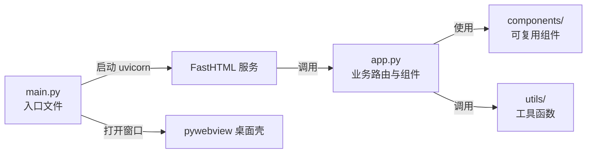

# 项目结构与代码规范

## 标准项目结构

### 方案 A：扁平包（推荐，默认）

单层 `src/app.py`，适合中小型项目。

### 方案 B：嵌套包（适用于复杂项目）

当应用需要多个业务模块分层时，使用嵌套包结构：

```
my-desktop-app/
├── src/
│   ├── __init__.py          ← 使 src 成为包
│   ├── main.py
│   └── myapp/               ← 业务逻辑包
│       ├── __init__.py
│       ├── app.py            ← FastHTML 路由 & UI
│       ├── api_client.py     ← API 客户端
│       ├── config.py         ← 配置
│       ├── service.py        ← 业务逻辑
│       └── ...
```

**选择依据**：

| 维度 | 扁平包 (方案 A) | 嵌套包 (方案 B) |
|------|----------------|----------------|
| 项目复杂度 | 简单/中等（1-3 模块） | 复杂（4+ 模块） |
| 模块多语言支持 | ❌ 无法按模块拆分 | ✅ `service.py` / `api` / `model` 各司其职 |
| 导入路径 | `from app import app` | `from myapp.app import app` |
| PyInstaller 配置 | 无需额外 hook | 需要 `--collect-submodules myapp` |
| 原型到代码迁移 | 直接覆盖 `app.py` | 新建包目录，逐步迁移 |
| 适用示例 | 01-04 最小示例 | 05-06 综合示例 |

`main.py.tmpl` 支持自动检测两种结构：优先尝试 `from app import app`，失败后自动扫描 `src/` 下子包。

---

## 标准项目结构（方案 A：扁平包）

所有 `fasthtml-desktop` 项目统一使用以下结构：

```
my-desktop-app/
├── pyproject.toml            ← 项目配置与依赖声明
├── .venv/                    ← 虚拟环境（不提交）
├── .env.example              ← 环境变量模板
├── .gitignore                ← 忽略规则
├── src/
│   ├── __init__.py
│   ├── main.py               ← ★ 应用入口（pywebview + uvicorn，基本不动）
│   ├── app.py                ← ★ 业务代码（FastHTML 路由 + 组件，你的主要工作区）
│   ├── components/           ← 可复用的 FastTags 组件（可选）
│   │   ├── __init__.py
│   │   ├── layout.py         ← 布局组件
│   │   └── widgets.py        ← 业务组件
│   ├── utils/                ← 工具函数（可选）
│   │   ├── __init__.py
│   │   └── helpers.py
│   └── pyinstaller_hooks/    ← PyInstaller 元数据钩子
│       ├── __init__.py
│       └── hook-genai_prices.py
├── data/                     ← 运行时数据（SQLite 数据库等）
│   └── .gitkeep
├── tests/                    ← 测试
│   └── __init__.py
└── README.md                 ← 使用说明
```

### 三个核心文件的分工



#### main.py（入口层）

负责：
- 检测 `sys.frozen` 确定 BASE_DIR
- 启动 uvicorn（`reload=False`）
- 延迟 1.5 秒打开 pywebview 窗口
- 提供优雅退出逻辑

**此文件生成后基本不需要修改。**

#### app.py（业务层）

负责：
- 定义 FastHTML 路由
- 编写 FastTags 组件
- 处理表单、HTMX 交互
- 调用后端逻辑

**这是用户的主要工作区。**

#### components/（复用层，可选）

当多个路由共享相同 UI 组件时，放入此目录：
- 布局组件（侧边栏、导航栏）
- 业务组件（数据表格、图表卡片）
- 表单组件（搜索框、文件上传区）

---

## 代码规范

### 导入顺序

```python
# 1. 标准库
import sys, os, json
from pathlib import Path

# 2. 第三方库
from fasthtml.common import *
import webview
import uvicorn

# 3. 本地模块
from components.layout import sidebar
from utils.helpers import format_date
```

### FastHTML 组件规范

- 位置参数 = 子元素（children）
- 关键字参数 = HTML 属性
- 保留字用下划线别名：`cls` → `class`，`_for` → `for`
- 所有 CSS/JS 必须内联到 `Style()` / `Script()`，不依赖外部文件

```python
# 正确
Div(H1("标题"), P("正文"), cls="container")

# 错误（关键字参数在位置参数前）
Div(cls="container", H1("标题"))
```

### 路径适配（打包安全）

```python
if getattr(sys, 'frozen', False):
    BASE_DIR = Path(sys.executable).parent   # 打包后：exe 所在目录
else:
    BASE_DIR = Path(__file__).parent.parent   # 开发环境：项目根目录

DB_PATH = BASE_DIR / "data" / "app.db"
CONFIG_PATH = BASE_DIR / "config.json"
```

### 日志规范

```python
import logging
from logging.handlers import RotatingFileHandler

LOG_DIR = BASE_DIR / "logs"
LOG_DIR.mkdir(exist_ok=True)

logging.basicConfig(
    level=logging.INFO,
    format="%(asctime)s - %(levelname)s - %(name)s - %(message)s",
    handlers=[
        RotatingFileHandler(LOG_DIR / "app.log", maxBytes=5*1024*1024, backupCount=30),
        logging.StreamHandler(),
    ]
)
logger = logging.getLogger(__name__)
```

### 类型注解

所有函数和方法必须有完整的类型注解：

```python
def process_file(filepath: Path, output_dir: Path) -> dict[str, int]:
    """处理文件并返回统计结果"""
    ...
```

---

## 约束总结

| 约束 | 原因 | 例外情况 |
|------|------|---------|
| CSS/JS 本地打包 | 打包后 static_path 映射不可靠 | 开发阶段可用 pico=True；打包前必须替换为本地版本 |
| 不用 `serve()` 用 `uvicorn.run(reload=False)` | 冻结后 reload=True 找不到模块 | 开发阶段可用 `reload=True` 加速调试 |
| 路径必须 `sys.frozen` 检测 | 打包后 `__file__` 指向临时目录 | 无例外 |
| 一律 `console=True` | 用户看到启动日志和地址 | 发布版可 `console=False` 隐藏 |
| 日志写入 `BASE_DIR / logs` | 打包后 APPDATA 可写 | 可自定义目录，需确保目录存在 |
| 外部静态文件通过 `--add-data` 打包 | 打包后路径结构变化 | 字体/图片等二进制文件必须用此方式 |
| 不硬编码端口 | 端口可被占用 | 固定端口需异常处理 |

**验证方法**：
| 约束 | 验证命令 |
|------|---------|
| CSS/JS 本地打包 | 检查 `static/` 目录和 `--add-data` 配置 |
| console=True | `grep 'console' *.spec` 确认值 |
| 路径适配 | `grep -r '__file__' src/` 确认都有 `getattr(sys,'frozen')` 保护 |
| 端口固定 | `grep -r 'PORT\|5001' src/` 确认正确 |
